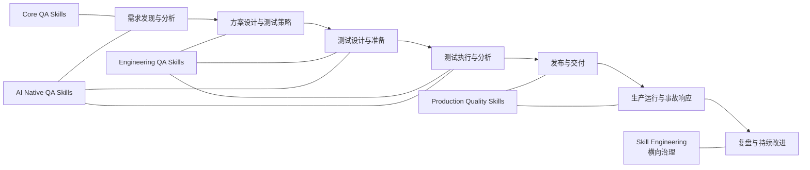

<strong>🇨🇳 中文</strong> | <a href="./skills-graph_EN.md">🇬🇧 English</a>

# Skills 关系图

这是导航辅助文档，不是安装依赖。物理包仍位于 `skills/{zh|en}/`。

## 能力全景

四层演进方向为：`Core QA Skills → Engineering QA Skills → Production Quality Skills → AI Native QA Skills`。节点表示主要生命周期归属，不代表必须严格按此顺序执行。

## 推荐组合

| 场景 | 推荐组合 | 输出 |
| --- | --- | --- |
| 新功能质量准备 | `requirements-analysis` → `test-strategy` → `test-case-writing` → `functional-testing` | 可追溯的测试范围、用例与执行结论 |
| 变更与回归决策 | `change-impact-analysis` → `regression-scope-analysis` → `regression-test-selection` | 有证据的回归范围和候选测试集 |
| API 交付 | `api-contract-testing` → `api-testing` → `test-reporting` | 契约兼容性、接口覆盖和交付报告 |
| 性能决策 | `performance-workload-modeling` → `performance-testing` → `performance-result-analysis` → `capacity-planning-analysis` | 负载假设、结果解释和容量风险 |
| 生产异常 | `metrics-anomaly-analysis` → `distributed-trace-analysis` → `production-incident-analysis` → `root-cause-analysis` | 证据时间线、待验证假设和后续动作 |
| AI 功能验证 | `ai-feature-testing` → `llm-evaluation-design` → `llm-testing` → `prompt-injection-testing` | 评测设计、行为证据和安全边界 |
| Agent 工具验证 | `ai-agent-testing` → `agent-tool-testing` → `prompt-injection-testing` | 状态、工具副作用与注入防护证据 |

各组合均为可选。入口或顺序不明确时使用 `discover-testing`。

## 使用边界

- `ai-assisted-testing` 属于 **AI for QA**，可辅助任一阶段，但不能替代 Testing for AI。
- 生产质量 Skill 仅分析证据并提出建议；发布、回滚、豁免和风险接受仍需人工审批。
- `skill-engineering` 是 Skill 治理能力，不是第五个 QA 生命周期阶段。

## 导航

- [全量索引](skills-index.md)
- [中文演进路线图](../governance/QA_SKILLS_EVOLUTION_ROADMAP.md)
- [English roadmap](../governance/QA_SKILLS_EVOLUTION_ROADMAP_EN.md)
