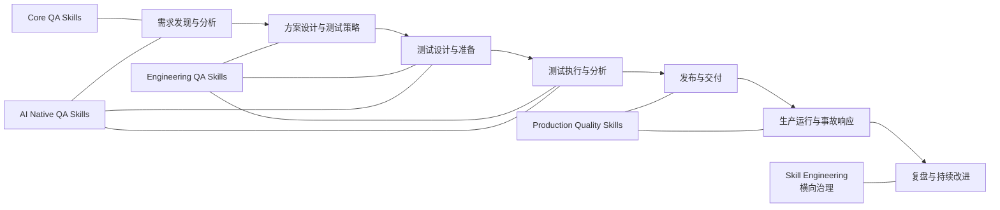

<strong>🇨🇳 中文</strong> | <a href="./skills-graph_EN.md">🇬🇧 English</a>

# Skills 关系图

这是导航辅助文档，不是安装依赖。物理包仍位于 `skills/{zh|en}/`。治理状态与匹配关系见 [治理矩阵](../SKILL_MATRIX.md)。

## 能力全景

四层演进方向为：`Core QA Skills → Engineering QA Skills → Production Quality Skills → AI Native QA Skills`。节点表示主要生命周期归属，不代表必须严格按此顺序执行。

## 推荐组合

| 场景 | 推荐组合 | 输出 |
| --- | --- | --- |
| v1.1 需求质量专项准备（可选） | `requirement-quality-review` → `requirements-analysis`；按需使用 `requirement-ambiguity-analysis` / `requirement-consistency-analysis` / `requirement-conflict-detection` / `requirement-traceability-analysis` | 证据有界的需求质量发现、专项问题和追踪缺口 |
| v1.1 设计质量专项准备（可选） | `business-rule-extraction`、`technical-design-quality-review`、`api-design-quality-review`、`database-design-quality-review`、`observability-design-review`、`error-handling-design-review`、`test-scope-analysis`；按需启用 `business-rule` / `architecture` / `coverage_analysis` 增强模式 | 业务规则、设计风险、测试范围和剩余风险的证据有界记录 |
| v1.1 测试设计发现专项准备（可选） | `test-gap-analysis`、`risk-based-testing`、`edge-case-discovery`、`negative-scenario-discovery`、`test-data-requirement-analysis` | 测试缺口、风险优先级、边界/负向候选和数据准备阻塞的证据有界记录 |
| 新功能质量准备 | `requirements-analysis` → `test-strategy` → `test-case-writing` → `functional-testing` | 可追溯的测试范围、用例与执行结论 |
| 变更与回归决策 | `change-impact-analysis` → `regression-scope-analysis` → `regression-test-selection` | 有证据的回归范围和候选测试集 |
| API 交付 | `api-contract-testing` → `api-testing` → `test-reporting` | 契约兼容性、接口覆盖和交付报告 |
| 性能决策 | `performance-workload-modeling` → `performance-testing` → `performance-result-analysis` → `capacity-planning-analysis` | 负载假设、结果解释和容量风险 |
| 生产异常 | `metrics-anomaly-analysis` → `distributed-trace-analysis` → `production-incident-analysis` → `root-cause-analysis` | 证据时间线、待验证假设和后续动作 |
| AI 功能验证 | `ai-feature-testing` → `llm-evaluation-design` → `llm-testing` → `prompt-injection-testing` | 评测设计、行为证据和安全边界 |
| Agent 工具验证 | `ai-agent-testing` → `agent-tool-testing` → `prompt-injection-testing` | 状态、工具副作用与注入防护证据 |

## v2.0 Test Engineering 推荐组合

| 场景 | 推荐组合 | 输出 |
| --- | --- | --- |
| v2.0 测试设计方法 | `decision-table-testing`、`state-transition-testing`、`boundary-value-testing`、`equivalence-partitioning`、`pairwise-testing`、`combinatorial-testing`、`model-based-testing`、`property-based-testing`、`metamorphic-testing` | 规则、状态、数据域、因素、模型和参考关系的证据有界设计候选 |
| v2.0 API 契约与失败语义 | `api-schema-validation` → `api-negative-testing` → `api-error-contract-testing`；按需使用 `api-idempotency-testing` / `api-pagination-testing` / `api-rate-limit-testing` / `api-version-compatibility-testing` | 契约、失败语义、重复请求、分页、限流和版本兼容的待验证发现 |
| v2.0 UI 稳定性 | `ui-test-strategy` → `ui-test-selector-review` → `ui-test-wait-strategy-review`；按需使用 `visual-regression-testing` / `cross-browser-testing` | UI 范围、选择器、等待、视觉基线和浏览器差异的证据有界发现 |
| v2.0 测试资产质量 | `test-code-review` → `mutation-testing-analysis`；按需使用 `mock-quality-review` / `test-suite-health-analysis` | 测试代码、变异充分性、Mock 真实性和测试套件健康度的风险与验证动作 |

各组合均为可选。入口或顺序不明确时使用 `discover-testing`。

## v3-v4 Phase 3 推荐组合

| 场景 | 推荐组合 | 输出 |
| --- | --- | --- |
| 可靠性与故障路径 | `reliability-testing` → `resilience-testing` → `failover-testing` / `recovery-testing`；按需使用 `retry-testing` / `timeout-testing` / `circuit-breaker-testing` / `dependency-failure-testing` / `disaster-recovery-testing` / `chaos-testing` | 可靠性目标、故障模式、降级、切换和恢复证据准备 |
| 身份与 API 安全 | `security-requirement-review` → `authentication-testing` / `authorization-testing` → `session-security-testing` / `api-security-testing`; 按需使用 `threat-modeling` / `secrets-exposure-review` | 安全需求、身份、授权、会话、攻击面和暴露证据 |
| 质量工程与效能 | `quality-gate-design` → `quality-metrics-design` → `quality-dashboard-design`；按需使用 `quality-debt-analysis` / `quality-maturity-assessment` / `test-effectiveness-analysis` / `automation-roi-analysis` / `testing-bottleneck-analysis` / `regression-optimization` / `ci-test-optimization` / `test-runtime-optimization` / `test-maintenance-cost-analysis` / `quality-productivity-metrics` | 质量门禁、指标、仪表盘、债务、成熟度和效能分析 |
| AI Native quality | `rag-retrieval-testing` → `rag-quality-testing` → `llm-hallucination-testing` / `llm-consistency-testing`；`prompt-testing` 的 `prompt-regression` 模式用于版本对比 | RAG 与 LLM 的检索、grounding、声明证据和一致性分析 |
| Agent quality and safety | `agent-loop-testing` → `agent-memory-testing` / `agent-permission-testing` → `agent-failure-recovery-testing` / `agent-long-running-testing` / `multi-agent-testing` / `ai-safety-testing` | Agent 状态、工具权限、恢复、协作、长运行和安全边界 |

当前 Project 快照显示 v3-v4 Phase 3 的 17 个 Batch 1 卡片和 25 个 Batch 2 卡片均为 `Done`；仓库记录了 `Match → RED 契约 → 实现 → 质量门禁` 的交付物，但 `In Progress → Done` 的历史转移仍为 `UNASSESSED`。`prompt-regression-testing` 作为 `prompt-testing` 的增强模式交付，不创建别名目录。

## 使用边界

- `ai-assisted-testing` 属于 **AI for QA**，可辅助任一阶段，但不能替代 Testing for AI。
- 生产质量 Skill 仅分析证据并提出建议；发布、回滚、豁免和风险接受仍需人工审批。
- `skill-engineering` 是 Skill 治理能力，不是第五个 QA 生命周期阶段。
- v1.1 需求质量组合只是可选导航；箭头不表示安装依赖、强制顺序或跨 Skill 内部文件链接。
- v1.1 设计质量组合是可选导航；三个候选卡片以现有物理 Skill 的增强模式交付，不产生别名目录。
- v1.1 测试设计发现组合是可选导航；五个候选卡片以独立双语物理 Skill 交付，不产生跨 Skill 内部依赖，也不把候选发现写成执行或覆盖结论。
- v2.0 Test Engineering 组合是可选导航；25 个候选卡片以独立双语物理 Skill 交付，不产生安装依赖、跨 Skill 内部链接或运行时执行结论。
- v2.0 Skill 只基于提供的规格、代码、测试资产或报告提出发现；真实模型 Eval、API/UI/数据库/变异执行和发布审批仍保持未运行或待人工决策。
- v3-v4 Phase 3 的可靠性与安全 Skill 只形成证据有界的测试/审查准备，不注入故障、不读取实时凭据、不宣称安全认证或恢复演练已执行；Project 卡片状态也不等于发布或风险接受。
- v3-v4 Phase 3 的 QE 与 AI Native Skill 只形成指标、效能、RAG/LLM、Agent 和安全分析的证据有界准备；不把静态契约、触发词或目录存在写成真实模型效果、运行时覆盖、质量分数或业务验收。

## 导航

- [全量索引](skills-index.md)
- [中文演进路线图](../governance/QA_SKILLS_EVOLUTION_ROADMAP.md)
- [English roadmap](../governance/QA_SKILLS_EVOLUTION_ROADMAP_EN.md)
- [v1.1 需求质量 Phase 1](../governance/PHASE_1_REQUIREMENTS_QUALITY.md)
- [v3-v4 Phase 3](../governance/PHASE_3_V3_V4.md)
- [v1.0 源代码治理基线与逐项记录](../governance/SKILL_GOVERNANCE_V1.md)（静态证据，不代表运行质量）
