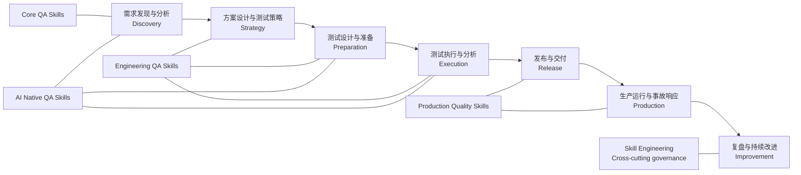

# Skills 关系图 | Skill Relationship Graph

中文为主；English follows each section. This graph is a navigation aid, not an installation dependency. Physical packages remain under `skills/{zh|en}/`.

## 能力全景 | Capability Landscape

The four-stage evolution is `Core QA Skills → Engineering QA Skills → Production Quality Skills → AI Native QA Skills`. The nodes show primary lifecycle placement, not a required execution order.

## 推荐组合 | Recommended Compositions

| 场景 | 推荐组合 | 输出 |
| --- | --- | --- |
| 新功能质量准备 | `requirements-analysis` → `test-strategy` → `test-case-writing` → `functional-testing` | 可追溯的测试范围、用例与执行结论 |
| 变更与回归决策 | `change-impact-analysis` → `regression-scope-analysis` → `regression-test-selection` | 有证据的回归范围和候选测试集 |
| API 交付 | `api-contract-testing` → `api-testing` → `test-reporting` | 契约兼容性、接口覆盖和交付报告 |
| 性能决策 | `performance-workload-modeling` → `performance-testing` → `performance-result-analysis` → `capacity-planning-analysis` | 负载假设、结果解释和容量风险 |
| 生产异常 | `metrics-anomaly-analysis` → `distributed-trace-analysis` → `production-incident-analysis` → `root-cause-analysis` | 证据时间线、待验证假设和后续动作 |
| AI 功能验证 | `ai-feature-testing` → `llm-evaluation-design` → `llm-testing` → `prompt-injection-testing` | 评测设计、行为证据和安全边界 |
| Agent 工具验证 | `ai-agent-testing` → `agent-tool-testing` → `prompt-injection-testing` | 状态、工具副作用与注入防护证据 |

Each composition is optional. Use `discover-testing` when the entry point or sequence is unclear.

## 使用边界 | Boundaries

- `ai-assisted-testing` is **AI for QA** and can assist any stage; it is not a replacement for Testing for AI.
- Production Skills analyze evidence and recommend actions; human approval remains required for release, rollback, waiver, or risk acceptance.
- `skill-engineering` governs Skill changes and prose quality; it is not a fifth QA lifecycle stage.

## 导航 | Navigation

- [全量索引 | Complete index](skills-index.md)
- [中文演进路线图 | Chinese roadmap](../governance/QA_SKILLS_EVOLUTION_ROADMAP.md)
- [English roadmap](../governance/QA_SKILLS_EVOLUTION_ROADMAP_EN.md)
