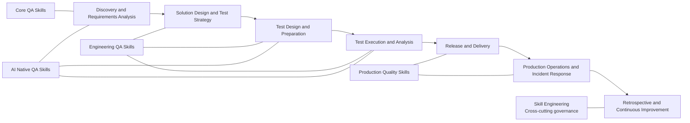

<a href="./skills-graph.md">🇨🇳 中文</a> | <strong>🇬🇧 English</strong>

# Skill Relationship Graph

This is a navigation aid, not an installation dependency. Physical packages remain under `skills/{zh|en}/`. See the [governance matrix](../SKILL_MATRIX_EN.md) for governance status and matching relationships.

## Capability Landscape

The evolution model is `Core QA Skills → Engineering QA Skills → Production Quality Skills → AI Native QA Skills`. Nodes show primary lifecycle placement, not a mandatory execution order.

## Recommended Compositions

| Scenario | Recommended composition | Outcome |
| --- | --- | --- |
| v1.1 requirement-quality focus (optional) | `requirement-quality-review` → `requirements-analysis`; use `requirement-ambiguity-analysis` / `requirement-consistency-analysis` / `requirement-conflict-detection` / `requirement-traceability-analysis` as needed | Evidence-bounded requirement findings, specialist gaps, and traceability risks |
| v1.1 design-quality focus (optional) | `business-rule-extraction`, `technical-design-quality-review`, `api-design-quality-review`, `database-design-quality-review`, `observability-design-review`, `error-handling-design-review`, `test-scope-analysis`; enable `business-rule` / `architecture` / `coverage_analysis` enhancement modes as needed | Evidence-bounded business rules, design risks, test scope, and residual risk |
| v1.1 test-design discovery focus (optional) | `test-gap-analysis`, `risk-based-testing`, `edge-case-discovery`, `negative-scenario-discovery`, `test-data-requirement-analysis` | Evidence-bounded test gaps, risk priorities, edge/negative candidates, and data-preparation blockers |
| New-feature quality preparation | `requirements-analysis` → `test-strategy` → `test-case-writing` → `functional-testing` | Traceable test scope, cases, and execution conclusion |
| Change and regression decision | `change-impact-analysis` → `regression-scope-analysis` → `regression-test-selection` | Evidence-based regression scope and candidate test set |
| API delivery | `api-contract-testing` → `api-testing` → `test-reporting` | Contract compatibility, API coverage, and delivery report |
| Performance decision | `performance-workload-modeling` → `performance-testing` → `performance-result-analysis` → `capacity-planning-analysis` | Workload assumptions, result interpretation, and capacity risk |
| Production anomaly | `metrics-anomaly-analysis` → `distributed-trace-analysis` → `production-incident-analysis` → `root-cause-analysis` | Evidence timeline, testable hypotheses, and follow-up actions |
| AI feature validation | `ai-feature-testing` → `llm-evaluation-design` → `llm-testing` → `prompt-injection-testing` | Evaluation design, behavior evidence, and safety boundaries |
| Agent tool validation | `ai-agent-testing` → `agent-tool-testing` → `prompt-injection-testing` | State, tool side-effect, and injection-defense evidence |

## v2.0 Test Engineering Compositions

| Scenario | Recommended composition | Outcome |
| --- | --- | --- |
| v2.0 test-design methods | `decision-table-testing`, `state-transition-testing`, `boundary-value-testing`, `equivalence-partitioning`, `pairwise-testing`, `combinatorial-testing`, `model-based-testing`, `property-based-testing`, `metamorphic-testing` | Evidence-bounded design candidates for rules, states, data domains, factors, models, and reference relations |
| v2.0 API contracts and failure semantics | `api-schema-validation` → `api-negative-testing` → `api-error-contract-testing`; use `api-idempotency-testing` / `api-pagination-testing` / `api-rate-limit-testing` / `api-version-compatibility-testing` as needed | Validation candidates for contracts, failure semantics, repeated requests, pagination, rate limits, and version compatibility |
| v2.0 UI stability | `ui-test-strategy` → `ui-test-selector-review` → `ui-test-wait-strategy-review`; use `visual-regression-testing` / `cross-browser-testing` as needed | Evidence-bounded findings for UI scope, selectors, waits, visual baselines, and browser differences |
| v2.0 test-asset quality | `test-code-review` → `mutation-testing-analysis`; use `mock-quality-review` / `test-suite-health-analysis` as needed | Risks and validation actions for test code, mutation adequacy, mock fidelity, and suite health |

Every composition is optional. Use `discover-testing` when the entry point or sequence is unclear.

## v3-v4 Phase 3 Compositions

| Scenario | Recommended composition | Outcome |
| --- | --- | --- |
| Reliability and failure paths | `reliability-testing` → `resilience-testing` → `failover-testing` / `recovery-testing`; use `retry-testing` / `timeout-testing` / `circuit-breaker-testing` / `dependency-failure-testing` / `disaster-recovery-testing` / `chaos-testing` as needed | Reliability objectives, failure modes, degradation, failover, and recovery evidence preparation |
| Identity and API security | `security-requirement-review` → `authentication-testing` / `authorization-testing` → `session-security-testing` / `api-security-testing`; use `threat-modeling` / `secrets-exposure-review` as needed | Security requirements, identity, authorization, session, attack-surface, and exposure evidence |
| Quality engineering and productivity | `quality-gate-design` → `quality-metrics-design` → `quality-dashboard-design`; use `quality-debt-analysis` / `quality-maturity-assessment` / `test-effectiveness-analysis` / `automation-roi-analysis` / `testing-bottleneck-analysis` / `regression-optimization` / `ci-test-optimization` / `test-runtime-optimization` / `test-maintenance-cost-analysis` / `quality-productivity-metrics` as needed | Quality gates, metrics, dashboards, debt, maturity, and productivity analysis |
| AI Native quality | `rag-retrieval-testing` → `rag-quality-testing` → `llm-hallucination-testing` / `llm-consistency-testing`; use the `prompt-regression` mode in `prompt-testing` for version comparison | Retrieval, grounding, claim evidence, and consistency analysis for RAG and LLM systems |
| Agent quality and safety | `agent-loop-testing` → `agent-memory-testing` / `agent-permission-testing` → `agent-failure-recovery-testing` / `agent-long-running-testing` / `multi-agent-testing` / `ai-safety-testing` | Agent state, tool permissions, recovery, coordination, long-running, and safety boundaries |

The current Project snapshot shows all 17 v3-v4 Phase 3 Batch 1 cards and 25 Batch 2 cards as `Done`; the repository records delivery artifacts for `Match → RED contract → implementation → quality gate`, but the historical `In Progress → Done` transition remains `UNASSESSED`. `prompt-regression-testing` is delivered as an enhancement mode inside `prompt-testing`, with no alias directory.

## Boundaries

- `ai-assisted-testing` is **AI for QA** and can assist any stage; it is not a replacement for Testing for AI.
- Production Quality Skills analyze evidence and recommend actions; releases, rollbacks, waivers, and risk acceptance still require human approval.
- `skill-engineering` governs Skills; it is not a fifth QA lifecycle stage.
- The v1.1 requirement-quality composition is optional navigation; arrows do not create installation dependencies, a mandatory order, or links to another Skill's internal files.
- The v1.1 design-quality composition is optional navigation; the three candidate cards are delivered as enhancement modes on existing physical Skills and do not create alias directories.
- The v1.1 test-design discovery composition is optional navigation; the five candidate cards are delivered as independent bilingual physical Skills, with no cross-Skill internal dependency and no upgrade from discovery to execution or coverage evidence.
- The v2.0 Test Engineering compositions are optional navigation; the 25 candidate cards are delivered as independent bilingual physical Skills without installation dependencies, cross-Skill internal links, or runtime-execution claims.
- v2.0 Skills produce findings from supplied specifications, code, test assets, or reports; real-model Eval, API/UI/database/mutator execution, and release approval remain unrun or require Human decisions.
- v3-v4 Phase 3 reliability and security Skills prepare evidence-bounded testing/review only: they do not inject faults, read live credentials, claim security certification, or claim a recovery drill ran; Project card status is not release approval or risk acceptance.
- v3-v4 Phase 3 QE and AI Native Skills prepare evidence-bounded metric, productivity, RAG/LLM, Agent, and safety analysis only; static contracts, triggers, or directory presence do not prove real-model effectiveness, runtime coverage, quality scores, or business acceptance.

## Navigation

- [Complete index](skills-index.md)
- [Chinese roadmap](../governance/QA_SKILLS_EVOLUTION_ROADMAP.md)
- [English roadmap](../governance/QA_SKILLS_EVOLUTION_ROADMAP_EN.md)
- [v1.1 requirement-quality Phase 1](../governance/PHASE_1_REQUIREMENTS_QUALITY_EN.md)
- [v3-v4 Phase 3](../governance/PHASE_3_V3_V4_EN.md)
- [v1.0 source-governance baseline and per-package records](../governance/SKILL_GOVERNANCE_V1_EN.md) (static evidence, not runtime quality)
- [v1.4 Phase 0 closeout](../governance/PHASE_0_V1_4_CLOSEOUT_EN.md) (governance evidence, not release approval)
- [v1.1–v1.4 Shift Left milestone](../governance/SHIFT_LEFT_MILESTONE_EN.md)
- [Candidate Skill 15-step template](../governance/CANDIDATE_SKILL_15_STEP_TEMPLATE_EN.md)
