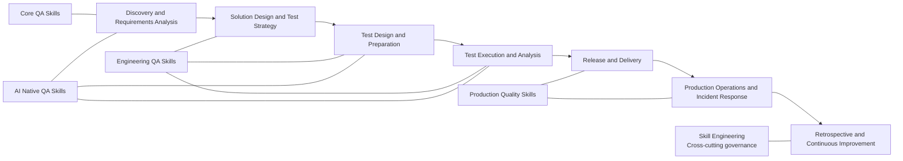

<a href="./skills-graph.md">🇨🇳 中文</a> | <strong>🇬🇧 English</strong>

# Skill Relationship Graph

This is a navigation aid, not an installation dependency. Physical packages remain under `skills/{zh|en}/`. See the [governance matrix](../SKILL_MATRIX_EN.md) for governance status and matching relationships.

## Capability Landscape

The evolution model is `Core QA Skills → Engineering QA Skills → Production Quality Skills → AI Native QA Skills`. Nodes show primary lifecycle placement, not a mandatory execution order.

## Recommended Compositions

| Scenario | Recommended composition | Outcome |
| --- | --- | --- |
| v1.1 requirement-quality focus (optional) | `requirement-quality-review` → `requirements-analysis`; use `requirement-ambiguity-analysis` / `requirement-consistency-analysis` / `requirement-conflict-detection` / `requirement-traceability-analysis` as needed | Evidence-bounded requirement findings, specialist gaps, and traceability risks |
| v1.1 design-quality focus (optional) | `business-rule-extraction`, `technical-design-quality-review`, `api-design-quality-review`, `database-design-quality-review`, `observability-design-review`, `error-handling-design-review`, `test-scope-analysis`; enable `business-rule` / `architecture` / `coverage_analysis` enhancement modes as needed | Evidence-bounded business rules, design risks, test scope, and residual risk |
| v1.1 test-design discovery focus (optional) | `test-gap-analysis`, `risk-based-testing`, `edge-case-discovery`, `negative-scenario-discovery`, `test-data-requirement-analysis` | Evidence-bounded test gaps, risk priorities, edge/negative candidates, and data-preparation blockers |
| New-feature quality preparation | `requirements-analysis` → `test-strategy` → `test-case-writing` → `functional-testing` | Traceable test scope, cases, and execution conclusion |
| Change and regression decision | `change-impact-analysis` → `regression-scope-analysis` → `regression-test-selection` | Evidence-based regression scope and candidate test set |
| API delivery | `api-contract-testing` → `api-testing` → `test-reporting` | Contract compatibility, API coverage, and delivery report |
| Performance decision | `performance-workload-modeling` → `performance-testing` → `performance-result-analysis` → `capacity-planning-analysis` | Workload assumptions, result interpretation, and capacity risk |
| Production anomaly | `metrics-anomaly-analysis` → `distributed-trace-analysis` → `production-incident-analysis` → `root-cause-analysis` | Evidence timeline, testable hypotheses, and follow-up actions |
| AI feature validation | `ai-feature-testing` → `llm-evaluation-design` → `llm-testing` → `prompt-injection-testing` | Evaluation design, behavior evidence, and safety boundaries |
| Agent tool validation | `ai-agent-testing` → `agent-tool-testing` → `prompt-injection-testing` | State, tool side-effect, and injection-defense evidence |

Every composition is optional. Use `discover-testing` when the entry point or sequence is unclear.

## Boundaries

- `ai-assisted-testing` is **AI for QA** and can assist any stage; it is not a replacement for Testing for AI.
- Production Quality Skills analyze evidence and recommend actions; releases, rollbacks, waivers, and risk acceptance still require human approval.
- `skill-engineering` governs Skills; it is not a fifth QA lifecycle stage.
- The v1.1 requirement-quality composition is optional navigation; arrows do not create installation dependencies, a mandatory order, or links to another Skill's internal files.
- The v1.1 design-quality composition is optional navigation; the three candidate cards are delivered as enhancement modes on existing physical Skills and do not create alias directories.
- The v1.1 test-design discovery composition is optional navigation; the five candidate cards are delivered as independent bilingual physical Skills, with no cross-Skill internal dependency and no upgrade from discovery to execution or coverage evidence.

## Navigation

- [Complete index](skills-index.md)
- [Chinese roadmap](../governance/QA_SKILLS_EVOLUTION_ROADMAP.md)
- [English roadmap](../governance/QA_SKILLS_EVOLUTION_ROADMAP_EN.md)
- [v1.1 requirement-quality Phase 1](../governance/PHASE_1_REQUIREMENTS_QUALITY_EN.md)
- [v1.0 source-governance baseline and per-package records](../governance/SKILL_GOVERNANCE_V1_EN.md) (static evidence, not runtime quality)
