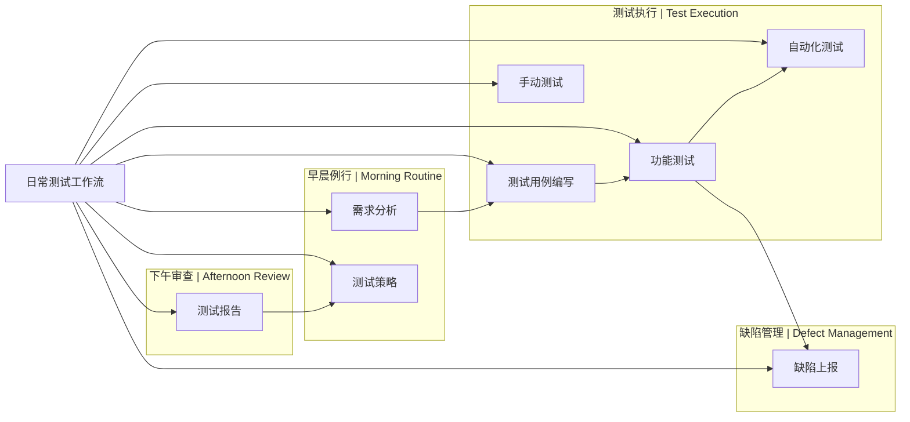

# Skills 依赖关系图 | Skills Dependency Graph

可视化展示 skills 之间的依赖关系和推荐组合。

Visualize dependencies and recommended combinations between skills.

---

## 整体架构图 | Overall Architecture


---

## 工作流详细依赖 | Workflow Detailed Dependencies

### 日常测试工作流 | Daily Testing Workflow



### 迭代测试工作流 | Sprint Testing Workflow


### 发布测试工作流 | Release Testing Workflow


---

## 测试类型依赖关系 | Testing Type Dependencies

### 功能测试生态 | Functional Testing Ecosystem


### API 测试生态 | API Testing Ecosystem


### 移动端测试生态 | Mobile Testing Ecosystem


---

## 推荐组合 | Recommended Combinations

### 组合 1: 新功能完整测试流程


**Skills**: requirements-analysis → test-strategy → test-case-writing → functional-testing → automation-testing → test-reporting

### 组合 2: API 开发测试流程


**Skills**: requirements-analysis → test-case-writing → api-testing → automation-testing → test-reporting

### 组合 3: 性能优化测试流程


**Skills**: test-strategy → performance-testing → test-metrics-analysis → test-reporting

### 组合 4: 安全审计流程


**Skills**: test-strategy → security-testing → test-case-writing → test-reporting

### 组合 5: 探索性测试流程


**Skills**: requirements-analysis → manual-testing → bug-reporting → test-reporting

---

## Skills 互补关系 | Skills Complementary Relationships

### 强互补（经常一起使用）

| Skill A | Skill B | 关系说明 |
|---------|---------|----------|
| requirements-analysis | test-case-writing | 需求分析后编写测试用例 |
| test-case-writing | functional-testing | 用例指导功能测试 |
| functional-testing | automation-testing | 功能测试后自动化 |
| automation-testing | test-reporting | 自动化结果生成报告 |
| test-strategy | test-reporting | 策略指导报告内容 |
| bug-reporting | functional-testing | 缺陷验证需要功能测试 |
| api-testing | automation-testing | API 测试通常自动化 |
| performance-testing | test-metrics-analysis | 性能数据需要分析 |

### 弱互补（偶尔一起使用）

| Skill A | Skill B | 关系说明 |
|---------|---------|----------|
| manual-testing | automation-testing | 手动测试可转为自动化 |
| security-testing | api-testing | API 安全测试 |
| accessibility-testing | functional-testing | 可访问性功能测试 |
| mobile-testing | performance-testing | 移动端性能测试 |

---

## Skills 依赖层级 | Skills Dependency Levels

### Level 0: 基础层（无依赖）

- requirements-analysis
- test-strategy

### Level 1: 核心层（依赖基础层）

- test-case-writing
- manual-testing

### Level 2: 执行层（依赖核心层）

- functional-testing
- api-testing
- bug-reporting

### Level 3: 自动化层（依赖执行层）

- automation-testing
- performance-testing
- security-testing
- accessibility-testing
- mobile-testing

### Level 4: 管理层（依赖多层）

- test-case-reviewer
- test-reporting

### Level 5: 工作流层（编排多个 skills）

- daily-testing-workflow
- sprint-testing-workflow
- release-testing-workflow

### Level 6: 高级层（智能化）

- ai-assisted-testing
- test-strategy-generator
- test-metrics-analysis
- skill-orchestrator

---

## 使用建议 | Usage Recommendations

### 初学者路径

```
requirements-analysis → test-case-writing → manual-testing → bug-reporting
```

### 中级路径

```
requirements-analysis → test-strategy → test-case-writing → functional-testing → automation-testing → test-reporting
```

### 高级路径

```
test-strategy-generator → skill-orchestrator → [multiple skills] → test-metrics-analysis
```

### 专项路径

**性能测试专项**:
```
test-strategy → performance-testing → test-metrics-analysis → test-reporting
```

**安全测试专项**:
```
test-strategy → security-testing → test-case-writing → test-reporting
```

**移动端测试专项**:
```
requirements-analysis → mobile-testing → automation-testing → test-reporting
```

---

## 相关资源 | Related Resources

- [Skills 索引](skills-index.md) - 按类别/场景/标签查找 skills
- [使用场景索引](docs/use-case-index.md) - 详细的场景指导
- [学习路径](docs/guides/learning-paths.md) - 系统学习指南
- [工作流模板](templates/workflow-templates/) - 预定义的 skill 组合

---

**最后更新 | Last Updated**: 2024-02-06
